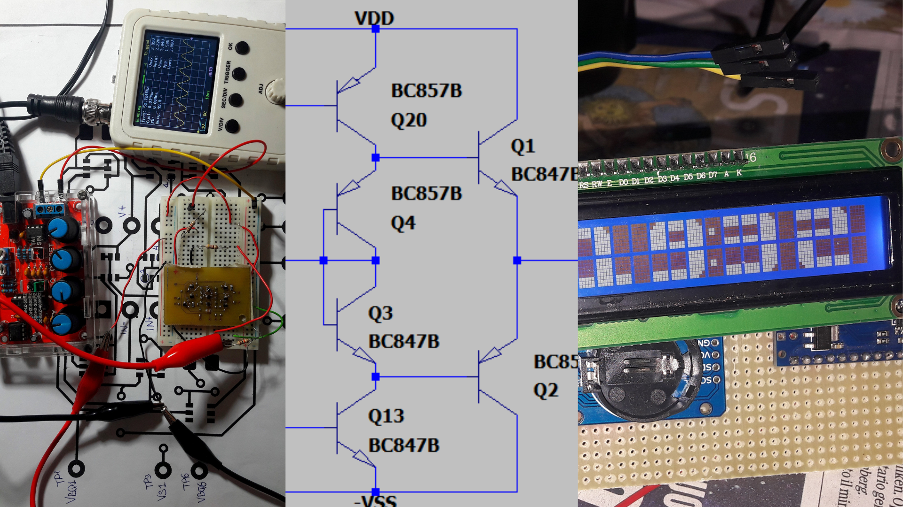

## REPOS LIST: 

#### 🛠 Hardware:
- [Discrete OpAmp](https://github.com/AleDedor/Discrete_OpAmp): A fully working three stages opamp, based on SOT363 discrete bjts and nmos.
#### 💻 Embedded:
#### 🎓 University projects (Politecnico di Milano, EE) :
- [STM32Nucleo - Codec shield](https://github.com/AleDedor/STM32Nucleo-Codec-Shield): A TLV320AIC3101-Codec based shield targeting STM32F401RE Nucleo boards and a multi-threaded program for real-time audio data processing.
